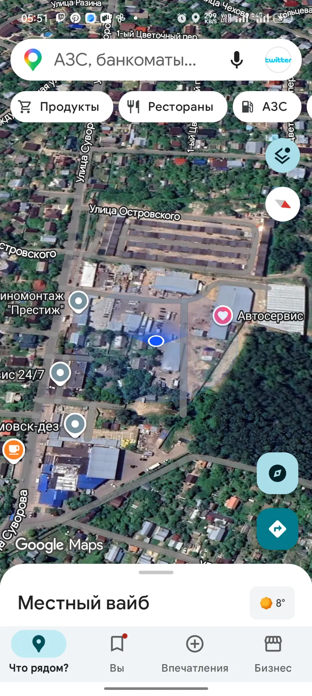
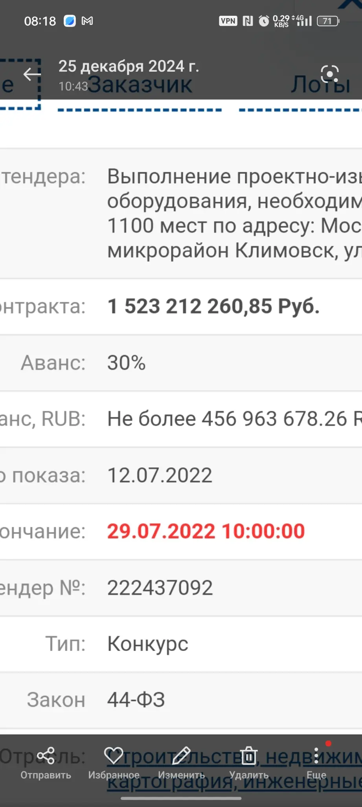

# Климовск: школа, закупка и визуальный контекст района

Это открытое исследовательское досье о новой школе в микрорайоне Климовск городского округа Подольск, близлежащих объектах и визуальных наблюдениях по картам. Документ отделяет **проверенные сведения** от **гипотез, которые не подтверждены документами**. Он не утверждает наличие тайной организации, взятки, скрытого ритуала или воздействия на людей.

## Краткий вывод

По опубликованным материалам речь идёт о новой общеобразовательной школе на **1100 мест** по адресу **улица Победы, 3В, микрорайон Климовск**. В карточке закупки указана начальная цена **1 523 212 260 рублей**, аванс — **30%**, а предмет закупки включает проектно-изыскательские работы, строительно-монтажные работы и поставку оборудования [1]. В открытых материалах нет основания превращать эту сумму или вместимость школы в доказательство взятки.

Местная публикация о закладке капсулы действительно описывает церемонию с посланием потомкам [2]. В контексте строительства это публичная памятная традиция, а не свидетельство эзотерического или скрытого ритуала. Для проверки коррупции нужны результаты закупки, контракт, изменения цены, акты исполнения, сведения о подрядчике и независимый финансовый анализ.

## Что подтверждено источниками

| Тема | Проверяемое сведение | Источник и статус |
|---|---|---|
| Вместимость | Школа рассчитана на 1100 учеников | Публикации Подмосковья и МК; подтверждается несколькими источниками [3] [4] |
| Адрес | Улица Победы, дом 3В, Климовск | Материалы закупки и публикация о строительстве [1] [2] |
| Цена закупки | Начальная цена 1 523 212 260 рублей | Карточка РосТендера; это НМЦК, а не автоматически окончательная цена и не доказательство переплаты [1] |
| Состав работ | Проектирование, изыскания, строительство, монтаж и оборудование | Карточка закупки [1] |
| Церемония | В 2023 году описана закладка капсулы с посланием потомкам | Местное СМИ [2] |
| Открытие | В сентябре 2025 года сообщалось об открытии школы на 1100 мест | Публикация МК [3] |

## О числах «800 + 300» и «2026 = 1100»

Арифметическое совпадение не является доказательством финансовой схемы. Вместимость школы — это проектный показатель числа мест; бюджетная цена — стоимость закупки в определённый момент; год строительства — календарная дата. Эти величины относятся к разным категориям данных и сами по себе не образуют код или доказательство взятки. В отчёте они сохранены как пользовательская гипотеза, но не как установленный факт.

## Что может означать «странная фигурка» в буддийском контексте

По одному словесному описанию определить предмет нельзя. Если речь идёт о симметричном изображении, которое создают из цветного песка и затем разрушают, наиболее вероятный термин — **песочная мандала**. Если речь идёт о камнях с мантрами, это могут быть **мани-камни** или мани-стены. Небольшие глиняные или гипсовые буддийские фигурки иногда называют **ца-ца**. Эти термины описывают разные предметы и не связывают автоматически буддийскую традицию с Климовском или со строительством школы.

## Визуальная гипотеза о новых зданиях

На пользовательском снимке виден сервисный и складской участок рядом с улицами Суворова и Островского. Серо-синяя, ребристая или металлическая облицовка может быть следствием типовых строительных решений, требований к долговечности фасада, стоимости материалов, пожарных норм или единого дизайн-кода. Чтобы доказать общий проект или общего заказчика, нужно сравнить паспорта объектов, разрешения на строительство, проектную документацию и кадастровые сведения. Визуальное сходство фасадов без этих документов остаётся наблюдением, а не доказательством координации.

*Источник фотографии: предоставлен пользователем в рамках исследования. На снимке синяя точка Google Maps — маркер геопозиции телефона; картографический фон и подписи принадлежат соответствующему картографическому сервису. Снимок не используется как доказательство скрытой деятельности.*

## Сравнение закупок и подрядчиков

По открытым публикациям обнаруживаются несколько связанных, но не одинаковых объектов. Для прежней школы на 825 мест на улице Революции заказчиком выступало МКУ «Градостроительное управление», а подрядчиком — ООО «Триумф» [7]. В публикации о проекте указаны ориентиры около 718 млн рублей общей стоимости, включая 638 млн рублей строительно-монтажных работ и 100 млн рублей оборудования [8]. Эти суммы относятся к другому объекту, другому году и другой вместимости.

Для новой школы на 1100 мест на улице Победы, 3В официальный источник Министерства строительного комплекса Московской области прямо называет подрядчиком ООО «ГРМ» [9]. Таким образом, по доступным материалам подрядчик новой школы отличается от подрядчика прежней школы на улице Революции. ООО «Триумф» отдельно упоминается в связи с двумя школами на 1100 мест в микрорайоне Кузнечики — на Флотском проезде, 9 и Армейском проезде, 5 [10]. Это подтверждает повторное участие компании в строительстве социальных объектов Подольска, но не доказывает её участие в школе на Победы, 3В.

| Объект | Вместимость | Заказчик | Подрядчик | Открытая сумма/сведения |
|---|---:|---|---|---|
| Школа на улице Революции, Климовск | 825 мест | МКУ «Градостроительное управление» | ООО «Триумф» | Около 718 млн рублей; отдельные оценки работ и оборудования [7] [8] |
| Школа на улице Победы, 3В, Климовск | 1100 мест | Государственная/муниципальная программа | ООО «ГРМ» | НМЦК 1 523 212 260 рублей, аванс 30% [1] [9] |
| Две школы в Кузнечиках, Подольск | По 1100 мест | Муниципальные заказчики | ООО «Триумф» | Контракты заключены в августе 2019 года; сумма в доступной публикации не указана [10] |

## Сравнение фасадов школ Московской области

Документально подтверждённый пример визуально близкого решения найден в проекте школы на 1250 учеников вблизи деревни Путилково, городской округ Красногорск. Официальное описание указывает клинкерный кирпич, светлую штукатурку и металлические ламели с фактурой дерева у входной группы; проект связывается с группой «Самолёт» и бюро GAFAarchitects [11]. В другой московской публикации для школы на 1100 мест в Картмазово также описаны клинкерная плитка, металлические ламели и штукатурка [12].

Это показывает, что ламели и навесные металлические элементы являются распространённым архитектурным приёмом в современных образовательных проектах региона. Однако «похожий серо-синий ребристый фасад» не позволяет установить общего подрядчика, изготовителя панелей или единую скрытую программу. Для такого сравнения нужны проектные спецификации, паспорта фасадов, рабочая документация и закупки на поставку материалов.

В предоставленных пользователем скриншотах один уникальный материал относится к карточке закупки школы на 1100 мест: он показывает сумму **1 523 212 260,85 рубля**, аванс **30%**, дату окончания подачи заявок **29.07.2022** и внутренний номер агрегатора **222437092**. Номер агрегатора отличается от номера закупки **0148200005422000433** и карточки **61387630**, поэтому его следует считать альтернативным идентификатором той же закупки, а не отдельным тендером.

*Скриншот предоставлен пользователем. Публикуется как иллюстрация исходного материала; окончательные сведения сверяются по карточке закупки и официальным публикациям.*

## Какие документы нужны для проверки тендера

Для полноценной проверки следует получить из ЕИС и связанных официальных источников извещение, протокол подведения итогов, заключённый контракт, приложения с техническим заданием, сведения об изменениях цены и сроков, акты приёмки и платежи. Одна начальная цена закупки не позволяет оценить наличие нарушения. В доступной карточке закупки указан номер закупки **0148200005422000433** и тендер **№61387630** [1].

## Границы вывода

В ходе предварительной проверки не найдено достоверного документа, связывающего школу, церковь, вышки мобильной связи, предполагаемую группу людей, «сброс энергии» или исторические подразделения, упомянутые в пользовательском сообщении. Такие связи нельзя публиковать как факт без документальных доказательств. Если пользователь испытывает ощущение воздействия на мысли, преследования или угрозы, безопаснее обсудить это с доверенным человеком и медицинским специалистом, а при непосредственной опасности обратиться по номеру 112.

## Источники

[1] [РосТендер: закупка №61387630](https://rostender.info/tender/61387630) — карточка закупки, начальная цена, аванс и состав работ.

[2] [Кабельное ТВ Подольск: церемония закладки капсулы новой школы](https://m.tvpodolsk.ru/news/politics/v-podolske-proshla-tseremoniya-zakladki-kapsuly-novoy-shkoly/) — адрес, вместимость, площадь и описание публичной церемонии.

[3] [МК: в Климовске открылась новая школа на 1100 мест](https://www.mk.ru/social/2025/09/01/v-podmoskovnom-klimovske-otkrylas-novaya-shkola-na-1100-mest.html) — сообщение об открытии 1 сентября 2025 года.

[4] [РосТендер: новость о школе на 1100 мест](https://rostender.info/news/2022071301) — дата объявления конкурса и начальная цена 1,5 млрд рублей.

[5] [Публикация о школе на 1100 мест в Подольске](http://www.russia-on.ru/165961) — вторичное изложение адреса, сроков и муниципальной программы.

[6] [Официальная публикация Московской области](https://mosreg.ru/sobytiya/novosti/news-submoscow/gubernator-novuyu-shkolu-na-1-1-tys-mest-v-mkr-klimovsk-podolska-otkroyut-v-2025-godu) — официальный региональный источник о проекте; при автоматическом чтении страница показывала проверку бота, поэтому факты следует дополнительно сверить вручную.

[7] [Правительство Московской области: школа на 825 мест в Климовске](https://mosreg.ru/sobytiya/novosti/myn-obrazovaniya/podolsk/zdanie-shkoly-na-825-mest-vozvedut-v-mikrorayone-podolska-do-kontsa-goda) — подрядчик ООО «Триумф» и заказчик МКУ «Градостроительное управление».

[8] [Подольск: строительство школы на улице Революции](https://podolsk.bezformata.com/listnews/klimovsk-prodolzhaetsya-stroitelstvo-shkoli/72809054/) — площадь, вместимость и опубликованная разбивка стоимости прежнего проекта.

[9] [Министерство строительного комплекса МО: подрядчик ООО «ГРМ»](https://msk.mosreg.ru/sobytiya/novosti-ministerstva/26-09-2022-15-30-08-novuyu-shkolu-na-1100-mest-postroyat-v-podolskom-k) — подрядчик новой школы на улице Победы.

[10] [Подольск: две школы в Кузнечиках строит ООО «Триумф»](https://podolsk.bezformata.com/listnews/mikrorajone-podolska-ooo-triumf/77661162/) — два объекта по 1100 мест и дата заключения контрактов.

[11] [Правительство Московской области: школа на 1250 мест в Красногорске](https://mosreg.ru/sobytiya/novosti/news-submoscow/sovremennaya-shkola-na-1-2-tys-mest-poyavitsya-v-gorodskom-okruge-krasnogorsk) — металлические ламели, клинкер и светлая штукатурка.

[12] [Стройкомплекс Москвы: школа на 1100 мест в Картмазово](https://stroi.mos.ru/news/shkola-s-fantaziinymi-fasadami-poiavitsia-v-posielienii-moskovskii) — клинкерная плитка, металлические ламели и штукатурка.

## Новое исследование: компании, закупки и Кузнечики

Подготовлены нейтральная презентация и набор исследовательских заметок по публичным данным о территориях Климовска и Кузнечиков.

- [Содержание презентации](slides_content.md)
- [Исследовательские заметки и таблица компаний](research-notes-2026-08.md)
- [HTML-презентация](presentation/)
- [Чек-лист источников и границ анализа](presentation-research-todo.md)

Презентация различает подтверждённые сведения, вопросы для документальной проверки и неподтверждённые обвинения. В неё не включены персональные данные работников, адреса проживания или утверждения о преступлениях без решений компетентных органов.

## Новое исследование: юридические связи и фасады

Добавлен отдельный нейтральный отчёт с проверяемыми сведениями по компаниям на адресах Суворова 2А–2И, различиями между ООО «Триумф» и ООО «Триумф Групп», неопределённостью идентификации ООО «ГРМ», а также сравнением фасадных решений школ Путилково, Картмазово, Дмитровского района и Климовска:

- [Юридические связи и фасадные решения](legal-links-facades.md)
- [Рабочие заметки и источники](legal-links-facades-notes.md)

Выводы отчёта ограничены открытыми данными: адресная связь не приравнивается к собственности, а визуальное сходство панелей не приравнивается к общему подрядчику или производителю.

## Финансово-контрактная проверка компаний

Добавлена справка по ООО «Корпорация Глобал Бетон» и ООО «Областной центр дезинфекции»: реквизиты, доступные финансовые показатели, публичные госконтракты, исполнительные производства и расхождения между агрегаторами:

- [Финансы и госконтракты компаний](companies-finance-contracts.md)

По участкам Суворова 2А–2И пока не найден надёжный публичный кадастровый номер, позволяющий безошибочно заказать выписку по каждому объекту. Адрес регистрации компании не равен праву собственности на землю. Для точного результата нужны кадастровые номера и официальные выписки ЕГРН.

## Бесплатная кадастровая проверка

По бесплатным источникам удалось уточнить адресную геометрию, но не установить правообладателей участков. OpenStreetMap/Nominatim однозначно находит корпус 2А как офисное здание и объект автосервиса рядом; адрес 2И отдельно не разрешается в открытой индексируемой карте. НСПД предоставляет интерактивную кадастровую карту, однако без официальной выписки нельзя достоверно назвать собственника участка. Адрес регистрации юрлица не равен праву собственности на землю.

## Бесплатные источники и финансовая динамика ООО «Областной центр дезинфекции»

Для проверки контрактов без оплаты можно использовать [ЕИС закупок](https://zakupki.gov.ru/epz/main/public/home.html), [БФО ФНС](https://bo.nalog.gov.ru/), [реестр РНП ФАС](https://br.fas.gov.ru/), [Картотеку арбитражных дел](https://kad.arbitr.ru/), [Федресурс](https://fedresurs.ru/), [ЕГРЮЛ ФНС](https://egrul.nalog.ru/) и реестр лицензий Роспотребнадзора.

По доступной бухгалтерской динамике ООО «Областной центр дезинфекции» выручка составила 48,93 млн рублей в 2019 году, 68,12 млн в 2020 году, 56,81 млн в 2021 году, 41,71 млн в 2022 году, 37,99 млн в 2023 году, 47,06 млн в 2024 году и 53,41 млн в 2025 году. Чистая прибыль за те же годы составила соответственно 7,12; 8,74; 1,74; 0,538; 0,684; 0,680 и 0,644 млн рублей. В 2025 году оборот вырос по сравнению с 2024 годом, но прибыль немного снизилась. Подробная таблица и методика находятся в [рабочих заметках](legal-links-facades-notes.md).

## РНП ФАС, арбитраж и история ЕГРЮЛ

Добавлена отдельная справка по ООО «КГБ» и ООО «Областной центр дезинфекции»: статус в доступных срезах РНП, арбитражные дела, текущие руководители и учредители, корпоративные связи ОЦД и ограничения бесплатных исторических данных:

- [Справка ФАС, арбитраж и ЕГРЮЛ](fas-arbitration-egrul.md)

## КАД и связанные компании

Подробная проверка дела А40-27248/2019 и открытых сведений по ООО «ВЕЗУРЕКЛАМУ.РУ» и ООО «ОЦД-МАРКЕТ» опубликована в [kad-and-related-companies.md](kad-and-related-companies.md).

## Контракты ОЦД и связи Дмитрия Кутьева

Новый отчёт сопоставляет публичные счётчики закупок ООО «Областной центр дезинфекции», объясняет расхождения агрегаторов и перечисляет связанные через ФНС/ЕГРЮЛ юридические лица: [ocd-contract-overlap-and-kutyev-links.md](ocd-contract-overlap-and-kutyev-links.md).

## ЕИС и Попов Дмитрий Игоревич

Построчная выборка доступных карточек закупок ОЦД и проверка публичных ролей Попова Дмитрия Игоревича опубликованы в [eis-row-analysis-and-egrul-popov.md](eis-row-analysis-and-egrul-popov.md).

## Презентация ОЦД и проверенная выборка 44-ФЗ

Готовая 11-слайдовая презентация находится в каталоге [ocd-presentation](ocd-presentation/). Машиночитаемая проверенная выборка открытых карточек находится в файле [ocd_44fz_verified_sample.csv](ocd_44fz_verified_sample.csv). Срез содержит четыре карточки, которые удалось прочитать и сопоставить по открытым источникам.

Публичные сервисы показывают показатель 232 контрактов по 44-ФЗ, но официальный полный экспорт всех 232 строк через текущий доступ к ЕИС получить не удалось. Поэтому CSV намеренно не выдаётся за полный реестр: недостающие строки не моделировались и не заполнялись предположениями.
