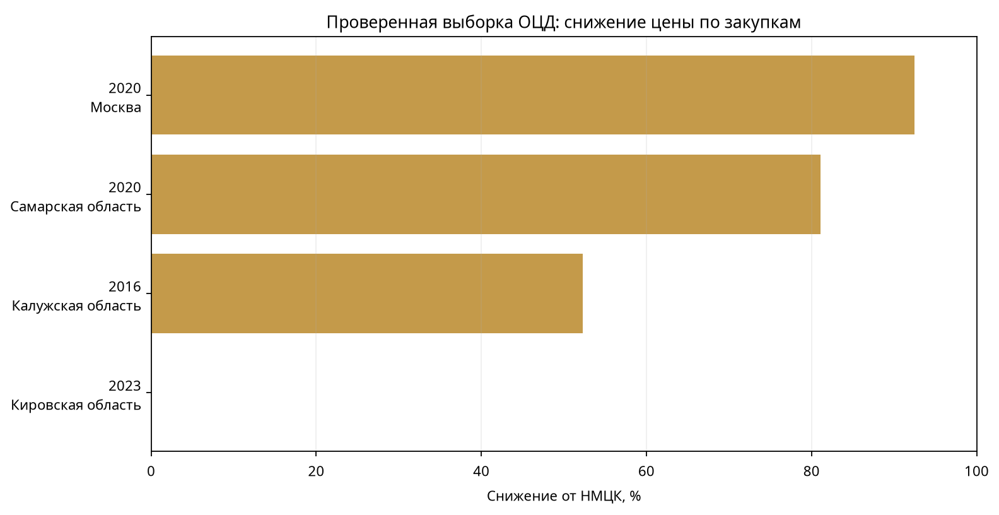

# Анализ ценовых предложений ООО «Областной центр дезинфекции» и документальный контур проверки картеля

**Автор:** Manus AI  
**Дата:** 15 августа 2026 года  
**Объект:** ООО «Областной центр дезинфекции», ИНН `5021001371`  
**Статус:** рабочий аналитический отчёт по доступной проверенной выборке; не является юридическим заключением.

> Важно: в репозитории сейчас находится не полный экспорт 232 контрактов, а проверенная выборка из **4 строк**. Поэтому ниже приведён полный расчёт по всем доступным строкам и одновременно зафиксировано, какие данные необходимы для корректного анализа всех 232 контрактов. Отсутствующие ценовые предложения нельзя восстанавливать по одной итоговой цене и нельзя заменять оценочными значениями.

## 1. Что требуется доказать при проверке картельного соглашения

Разъяснение ФАС России № 14 указывает, что предмет доказывания по делам о картелях на торгах включает наличие устного или письменного соглашения, предмет соглашения, состав участников и их конкурентные отношения, наличие или возможность последствий в виде повышения, снижения или поддержания цен, а также причинно-следственную связь между соглашением и ценовым последствием [1]. ФАС отдельно разъясняет, что для анализа торгов важны временной интервал, предмет торгов и состав хозяйствующих субъектов, участвовавших с момента подачи заявки [1].

Следовательно, одна только низкая итоговая цена, повторяемость участия или общее отраслевое направление не доказывают картель. Они могут быть основаниями для запроса протоколов и иных документов.

## 2. Какие официальные источники и документы нужны

| Блок проверки | Официальный источник | Что извлекать | Зачем нужно |
|---|---|---|---|
| Извещение и документация | [ЕИС](https://zakupki.gov.ru/epz/order/extendedsearch/results.html) | НМЦК, объект, лоты, требования, сроки, способ закупки, ограничения для МСП | Проверка сопоставимости закупок и методики НМЦК |
| Состав участников | ЕИС и документы электронной площадки | Все заявки, допуск/отклонение, идентификаторы участников, протоколы рассмотрения и подведения итогов | Установление реальной конкурентной группы |
| Ценовая динамика | Протоколы подачи/сопоставления ценовых предложений и журнал торгов | Каждое ценовое предложение, время подачи, шаг аукциона, порядок ставок, финальная цена | Анализ согласованного поведения, пассивных заявок и ротации |
| Исполнение | ЕИС: контракт, изменения, сведения об исполнении | Цена исполнения, акты, изменения цены/объёма, расторжение, односторонний отказ, неустойка | Отделение ценового поведения на торгах от фактического исполнения |
| Антимонопольные решения | [Банк решений ФАС](https://br.fas.gov.ru/) и [раздел ФАС по картелям](https://fas.gov.ru/questions/question_categories/7) | Решения и предписания по участникам, заказчикам, рынку и аналогичным торгам | Сопоставление с уже установленными признаками и правовыми подходами |
| РНП | ЕИС, раздел реестра недобросовестных поставщиков | Основание включения, дата, закупка, решение и срок | Проверка последствий неисполнения, но не доказательство картеля |
| ЕГРЮЛ | [ФНС ЕГРЮЛ](https://egrul.nalog.ru/index.html) | Исторические руководители, учредители, адреса, виды деятельности, реорганизации на даты торгов | Проверка юридических связей и группы лиц |
| Арбитраж | [КАД Арбитр](https://kad.arbitr.ru/) | Иски, решения, обеспечительные меры, споры о контрактах и конкуренции | Проверка документированных конфликтов и исполнения |
| Электронная площадка | Оператор площадки, указанной в извещении | Журнал действий, время подачи ставок, технические данные, документы заявок — при наличии законного основания доступа | Проверка координации, синхронности и технических совпадений |
| Налоговые и корпоративные сведения | ФНС, официальные бухгалтерские данные, раскрытие сведений в пределах закона | Отчётность, адреса, руководители, участники, изменения | Сопоставление деловой активности и корпоративной структуры |

ФАС указывает, что соглашение может быть устным или письменным, а доказательственная оценка должна связывать поведение участников и ценовое последствие [1] [2]. При подготовке обращения в антимонопольный орган необходимо описывать предмет торгов, территорию, период, предполагаемых участников, содержание предполагаемых согласованных действий и прилагать подтверждающие документы [2].

## 3. Доступная ценовая выборка

Файл `ocd_44fz_verified_sample.csv` содержит 4 уникальные закупки и следующие поля: реестровый номер закупки, год, заказчик, регион, предмет, начальная цена, итоговая цена, роль ОЦД и ссылку на карточку.

| Реестровый номер | Год | Регион | НМЦК, ₽ | Итог, ₽ | Снижение, ₽ | Снижение, % | Роль ОЦД |
|---|---:|---|---:|---:|---:|---:|---|
| `337100009416000045` | 2016 | Калужская область | 58 685,76 | 28 000,00 | 30 685,76 | **52,288%** | Победитель |
| `373200081220000058` | 2020 | Москва | 360 000,00 | 27 000,00 | 333 000,00 | **92,500%** | Победитель |
| `423000001200000494` | 2020 | Самарская область | 1 000 000,00 | 189 378,71 | 810 621,29 | **81,062%** | Участник; победил ООО «Зелёный мир» |
| `40200003323018` | 2023 | Кировская область | 64 240,00 | 64 240,00 | 0,00 | **0,000%** | Не ОЦД; победил Кировский областной центр дезинфекции |

Расчёт выполнен по формуле:

```text
снижение (%) = (НМЦК − итоговая цена) / НМЦК × 100
```

Для строки, где победителем был другой поставщик, итоговая цена не должна автоматически интерпретироваться как ценовое предложение ОЦД. Она отражает результат закупки, а не обязательно максимальную или последнюю ставку ОЦД.

## 4. Статистический разбор доступной выборки



*Рисунок относится только к 4 строкам проверенной выборки и не является графиком по всем 232 контрактам.*

| Показатель | Значение |
|---|---:|
| Строк с обеими ценами | 4 |
| Уникальных закупок | 4 |
| Минимальное снижение | 0,000% |
| Первый квартиль | 39,216% |
| Медианное снижение | 66,675% |
| Среднее снижение | 56,463% |
| Третий квартиль | 83,922% |
| Максимальное снижение | 92,500% |
| Строк, где ОЦД отмечен победителем | 3 |
| Строк с другим победителем/иной ролью ОЦД | 1 |

Распределение крайне нестабильно из-за малого `n=4`: одна московская закупка с уменьшением на 92,5% существенно влияет на максимум и среднее. Для статистически осмысленного анализа 232 контрактов необходимы все строки и одинаковая методика определения НМЦК, итоговой цены и роли ОЦД.

### Наблюдаемые паттерны, которые можно зафиксировать уже сейчас

Во-первых, в доступной выборке присутствует широкий диапазон результатов: от отсутствия снижения до снижения свыше 90%. Это не позволяет описать ОЦД единой ценовой стратегией на основании четырёх строк.

Во-вторых, максимальное снижение относится к московской закупке 2020 года, где ОЦД был отмечен победителем. Однако в представленной CSV отсутствуют индивидуальные ставки всех участников, временная последовательность шагов и протоколы, поэтому нельзя установить, каким образом сформировалась итоговая цена.

В-третьих, сам факт участия ОЦД в закупке, выигранной другой организацией, не является подтверждением пассивного поведения или договорённости. Для такого вывода нужны протоколы, заявки, ставки, повторяемость аналогичного поведения и иные независимые доказательства.

В-четвёртых, отсутствие снижения в строке по Кировской области относится к закупке, где победителем указан другой региональный центр. Эта запись полезна как контрольная строка для проверки качества выборки, но не как прямой показатель ценовой стратегии ОЦД.

## 5. Что именно нужно получить для анализа всех 232 контрактов

Минимальная таблица должна содержать одну строку на закупку и, отдельно, одну строку на каждое ценовое предложение. Для закупки нужны: реестровый номер, закон, способ закупки, дата, заказчик, предмет, лот, НМЦК, требования, число заявок и статус. Для каждого участника нужны: идентификатор участника, допуск, причина отклонения, итоговый статус, цена заявки и место. Для каждого шага аукциона нужны: время, цена, участник и номер шага.

Без этих полей можно рассчитать только разницу между НМЦК и итоговой ценой, но нельзя провести глубокий анализ индивидуального поведения участников. Особенно важны следующие тесты:

| Тест | Требуемые данные | Интерпретация |
|---|---|---|
| Повторяемость участников | участники по каждой закупке | выявляет устойчивые пары и группы |
| Ротация победителей | победитель, дата, предмет, регион | показывает распределение побед при сопоставимых условиях |
| Пассивная заявка | все ставки и протоколы | может быть индикатором, но требует контекста |
| Синхронность | точное время ставок и технические журналы | проверяет необычную согласованность действий |
| Ценовые кластеры | все заявки, НМЦК, единичные расценки | отличает рыночное снижение от повторяющейся схемы |
| Связи участников | исторический ЕГРЮЛ, адреса, руководители | проверяет группу лиц и общие реквизиты |
| Исполнение | акты, изменения, расторжения | выявляет согласованность после победы или фиктивную конкуренцию |

## 6. Вывод по текущим данным

Полный анализ всех 232 контрактов сейчас **невозможен без полного официального экспорта или дополнительной выгрузки**, поскольку в репозитории присутствует только 4-строчная проверенная выборка. По этой выборке рассчитаны следующие значения: медианное снижение — 66,675%, среднее — 56,463%, максимум — 92,5%, минимум — 0%.

Эти цифры описывают только доступные четыре строки и не могут быть экстраполированы на весь портфель ОЦД. На текущем массиве обнаруживается ценовая неоднородность, но не доказательный паттерн картеля. Для перехода от скрининга к полноценному расследованию нужны индивидуальные цены участников, временные протоколы, исторические ЕГРЮЛ, решения ФАС, документы исполнения и сведения электронной площадки.

## 7. Воспроизводимость

Расчёт выполняет скрипт `analyze_ocd_prices.py`. Он создаёт:

- `ocd_price_analysis/verified_sample_with_price_metrics.csv` — исходные строки с добавленными полями снижения;
- `ocd_price_analysis/summary.json` — агрегированные показатели;
- `ocd_44fz_verified_sample.csv` — исходную проверенную выборку.

Запуск:

```bash
python3 analyze_ocd_prices.py
```

Скрипт `check_ocd_contracts.py` предназначен для получения и первичного аудита карточек контрактов через зеркало Ofdata при наличии ключа. Ofdata не является официальным источником; каждую запись и статус необходимо сверять с ЕИС.

## References

[1]: https://www.consultant.ru/document/cons_doc_LAW_299485/ "Разъяснение ФАС России от 30.05.2018 № 14 о квалификации соглашений участников торгов"
[2]: https://fas.gov.ru/questions/question_categories/7 "ФАС России: борьба с картелями — официальные ответы и порядок подачи заявления"
[3]: https://zakupki.gov.ru/epz/order/extendedsearch/results.html "Единая информационная система в сфере закупок"
[4]: https://br.fas.gov.ru/ "Банк решений ФАС России"
[5]: https://egrul.nalog.ru/index.html "ФНС России: сервис проверки сведений ЕГРЮЛ"
[6]: https://kad.arbitr.ru/ "Картотека арбитражных дел"
[7]: https://fas.gov.ru/publications/24271 "ФАС России: сведения о выявленных картельных госзакупках в 2023 году"
